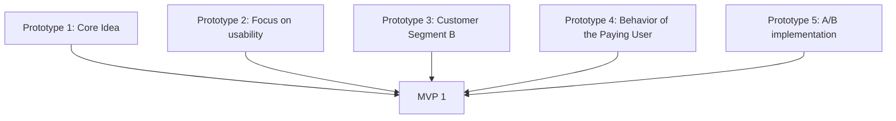
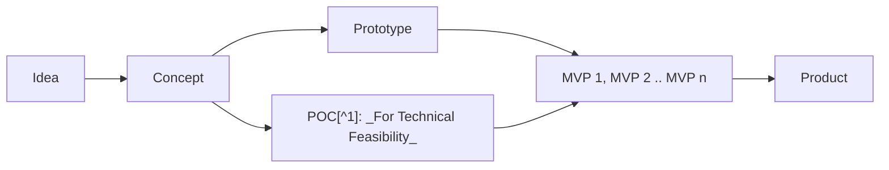

# This is a PROTOTYPE: _A Must Read from d.school_

_Why I did not read this book before I started building my MVP(s)_

---

## Overview

&nbsp; &nbsp; When you are a maker, builder or a founder (perhaps trying to be one), you must have played around these terms IDEA, CONCEPT, POC[^1], PROTOTYPE, MVP[^2] and PRODUCT. But have you ever wondered how these are related and also differ. Should you really bother to differentiate these. I believe you should, at least after my experience. After successful delivery of multiple MVPs at production grade and not being sure what the next steps are, I finally discovered some other component called a USER who eventually might become a CUSTOMER. Then landed on "Build what customer want?" then "You should be Talking to User", "what to ask", "how to ask" etc.

**PROTOTYPE** is a heavily overloaded term, [SCOTT WITTHOFT](https://www.linkedin.com/in/switthoft/) dissects this from numerous dimensions,

> What is a prototype as a noun? What is it as a verb? Why should you try one? Where should you do it? What do you need to do? How do you do it? Who can do it? What mindset is needed? How long do you have to do it? How many should you do? What stakeholders should be involved in prototyping? How do you test it? What would you observe from it? What is the output from the prototype? What is the outcome from the prototype?

With all these queries, this awesome life saver of a book [This is a PROTOTYPE](https://dschool.stanford.edu/shop/this-is-a-prototype) addresses many questions and frustrations on the path of product/feature building. This process can pave an road map to germinate a seed of an idea and grow it into a long-lasting tree.


This book, a must read from d.school, approaches prototyping with the following topics,

- What is a prototype?
- What do you need to build one?
- How do you build one?
- How do you test one?
- What do you get from this exercise.

Through this book, SCOTT gives me:

> - The freedom to be imperfect
> - The ability to learn and practice something new.

When I am learning to bake, I am instinctively nervous because I want to be right on the first attempt and I do not allow myself any margin for error. SCOTT constantly reiterates this in multiple ways:

- Building to invalidate
- Creating and tearing up
- Deliberately setting a moment to destroy your prototype

&nbsp;&nbsp; So far when I built an MVP, I keep it close to my ego. I want to incubate my idea and protect it as much as I can, and want to be right so bad. Any doubt on my idea hurts my ego. After completely ignoring the users, I eventually failed silently without notice. This book unshackled me from these ties, and disconnects me from my ego, putting me back into reality.

While I was building my MVPs, I kept oscillating on resolution (Low vs High) and tool usage (Coarse vs Fine). I was advised constantly to go for lower resolution which was against my instinct for perfection. Now I realize that this advise is for **prototyping**. As engineers are hardwired to write efficient, maintainable, reliable, scalable, testable and deployable code, they default to a path of higher resolution. But the priority even during building a MVP should be on iterating.

If I realized about the concepts in this book earlier, I would have reached product market fit by this time instead of wandering around bad practices such as:

> Building the MVP right away with efficient code, splendid UI and deploying everyone on a cutting edge CI/CD (deployment tool).

&nbsp;&nbsp; SCOTT has done a phenomenal job of breaking the mindset and attitude of a maker, builder or craftsman and rebuilding it into one of a **prototyper**. A prototyper is a crazy, experimental, and acts like a demanding mother to her child. She is shameless to strip the idea and expose it to the world for testament. She has no attachment to the idea and treats the conception as a wet clay.

## What is a prototype?

&nbsp; &nbsp; A prototype is a process to learn, explore and discover the required features for a MVP.

#### Prototype Process

```html
<div class="mermaid">
flowchart LR
DO[Define Objective] --> C[Catalog]
C--> DE[Design and Build Prototype]
DE --> TE[Test]
TE --> RE[Reflect]
</div>
```

#### Prototype to MVP



### Prototyping vs Product Building

| Prototyping                                             | Product building                   |
| ------------------------------------------------------- | ---------------------------------- |
| Prototyper                                              | Craftsman                          |
| Explore                                                 | Build                              |
| Tolerant                                                | Rigid                              |
| Doubts                                                  | Walks with confident               |
| Builds with what is available                           | Builds with best material possible |
| Deliberately chooses coarser tools and lower resolution | Perfection and best is the goal    |
| Fast                                                    | Steady                             |
| Will destroy the work at the end                        | Iterates for perfection at the end |
| Artistic                                                | Logical                            |

#### Product Building

When you have assimilated all the requirements from multiple prototypes, you have all the required ingredients to build the core product. It is shocking to know that prototyping means walking in the opposite direction of building a **product**.



#### Why do you need a prototype instead of talking to an user?

- Users may not know what they want and how it should work? (e.g. iPhone)
  - But they can visualize from a mock up.
- A solution might be harder to be understood by the user (e.g. UBER and NETFLIX)
  - They can understand with an experience of the prototype.

#### Why should you define your prototype?

Defining objectives for a prototype helps you stay within the boundaries of available resources and time to test on the right group, constantly looking for feedback. An optimum approach would be that prototypes are built with low resolution and would be scrapped at the end of the cycle, but still gives real product experience.

#### Why should you catalog your objectives?

&nbsp;&nbsp; By cataloging your objectives as:

- Functional
- Cognitive
- Emotional

You are prepared to carry out your work in proper channels to build and test your prototype with appropriate focus groups.

#### Make it fake but do it for real

&nbsp;&nbsp; Here the author clarifies that you are not deliberately building a dirty version, but instead your building something fast with the least amount of resources and bringing the experience as close to the real product as possible.

> Eg: For a digital product, you can build a production grade home page and 10 blogs using WordPress in a single day. Keep in mind you are going to destroy it once you are done with your experiment.

#### Make it an experience

&nbsp;&nbsp; Imagine you are in 2006 and envisioning to build an **iPhone**. You may not ask the user at that point how a smartphone should be. Instead, show him a **look alike** model of an iPhone or make him play with a **work alike** model.

## What do I need start?

Do you need your tools to shape your idea or do the tools you have trigger a new idea?

#### My skills as tool box

|                           |                                                                                            |
| ------------------------- | ------------------------------------------------------------------------------------------ |
| Building Skills           | <pre><p>WordPress </p><p>Back End: Django, AWS </p><p>Front End: Flutter, React </p></pre> |
| Marketing Skills          | <pre><p>Blogging (SEO)</p><p>Instagram</p><p>Youtube</p></pre>                             |
| Community Building Skills | <pre><p>Discord community</p><p>WhatsAPP community</p></pre>                               |
| AI Skills                 | <pre><p>ChatGPT</p></pre>                                                                  |

&nbsp;&nbsp; The author argues that when you are equipped with your tools and skills and exposed to a problem, you are inspired to form a new idea and your skills are amazing raw materials to start prototyping. He also insists two questions you should keep asking yourself:

> - Is my work too high resolution?
> - What is the cardboard version of this I could try first?

A cardboard version is quick, imperfect, welcomes feedback, will not make the reviewer sacared to pass comments, and very quick to change.

#### Space for making

&nbsp;&nbsp; Recently moved to physical books shelves from e-books. Book shelves are great for choosing books based on my mood. My subconsious picks elevating books when my mood is low and challenging books when my mood is high. Digital books are buried under the hood and are difficult to look back on.

> Interacting with materials is both a great way to create casual inspiration and a reminder that you have ready resources - SCOTT

#### Building blocks for Prototyping

> - Am I designing something new?
> - Am I designing a new version of something?

&nbsp;&nbsp; Like a cardboard box for physical prototypes, WordPress with Figma mock up and one pager React apps could be amazing building block for digital prototyping. During the building process of one of my previous MVPs, I've learned WordPress in detail, and went through a detailed digital marketing course. These two can give me a significant leap for the next prototype. It inspires me to move on to my next work.

## Conclusion

With this amazing piece, SCOTT not only rebuilt my mindset into a prototyper, he also lays down an efficient process in prototyping/making eventually to product market fit.

## Notes

[^1]: Proof of Concept
[^2]: Minimum Viable Product
