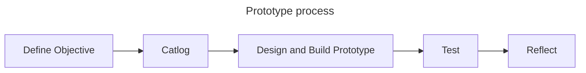
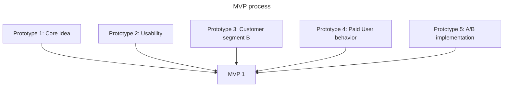
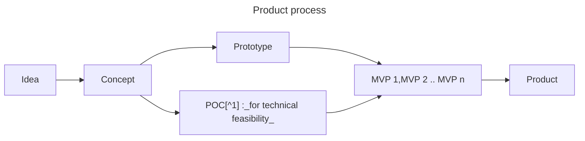

# This is a PROTOTYPE : _a must read from d.school_

_why I didnt read this book, before I start building my MVP(s)_

---

## Overview

&nbsp; &nbsp; When you are a Maker, Builder and Founder(or trying to be one), you must played around terms IDEA, CONCEPT, POC[^1], PROTOTYPE , MVP[^2] and PRODUCT. But have you ever wondered how these are related and differ. Should you really bother to differentiate these. Actually you should, at least after my experience. After successful delivery of multiple MVPs on production grade and not sure what to do next, I finally discovered some other component called USER who eventually become CUSTOMER. Then landed on "Build what customer want ?" eventually "You should be Talking to User", "what to ask" , "how to ask" etc.


**PROTOTYPE** is a heavily overloaded term, [SCOTT WITTHOFT](https://www.linkedin.com/in/switthoft/) dissects from numerous dimensions,
>What is it as a nown, as a verb ? Why will you do one ? Where will you do ? What do you need to do ? How to do ? Who can do it ? What mindset is needed ? How long you have to do ? How many would you do ? Stakeholders involved in prototyping ? How do you test ? What would you observe ? What is the output ? What is the outcome ?

With all these inquiries  this awesome life saver [This is a PROTOTYPE](https://dschool.stanford.edu/shop/this-is-a-prototype) addresses many questions and frustrations on the path of product/feature building. This process can pave awesome road map to germinate a seed of an idea and grow it into to a lasting Tree. 


This must read from d.school approches Prototyping in following topics,
```
- What is a prototype ?
- What do you need to build one ?
- How do you build one ?
- How do you test ?
- What do you get from this exercise.
```

Through this book SCOTT gives me 
> - The freedom to be imperfect
>  - Learn and practice something new. 

When I'm learning to bake , instinctly I'm nervous to be right on the first attempt itself and not allowing any margin for error. SCOTT keep re-iterates in multiple ways,
```
- Build to invalidate
- Create and tear up
- Deliberately set a moment to destroy your prototype
```
So far when I built an MVP, it is from my ego. I want to incubate my idea as protective as I can, and want to be right terribly. Any doubt on the idea hurts my ego badly. After completely ignoring the user and paying user in this eco system, eventually failed silently without notice.  This book unshackles me from these ties, and releases me from my ego and put me into reality.

While I was building my MVPs, kept oscilating on resolution and tool usage ( LOW vs High), I was kept adviced for lower resolution which is against my instict for perfection. Now I realize that those advices are for "Prototyping". As engineers are hardwired to write efficient, maintainable, reliable ,scalable, testable and deployable code, mostly they end up higher resolution path. But the priority even during MVP should be on iterations.

If I would have realized the concepts in this book earlier, I would have reached product market fit by this time. Instead of wandering around bad practices like, 

>Build MVP right away with efficient code , best UI everything deployed on cutting edge CI/CD 
   
&nbsp;&nbsp; SCOTT has done phenomenal job of break the mindset and attitude of a maker, builder or craftsman and rebuild into A Prototyper. A prototyper is crazy, experimental, demanding mom to her child, shameless to strip off his idea and expose to the world for testament, has no attachment to his idea and treats his conception as a wet clay.

## What is a prototype ?

&nbsp; &nbsp; A prototype is to learn, to explore and discover required features of a MVP.  
#### Prototype Process



#### Prototype to MVP



| Prototyping                                                             | Product building                    |
| ----------------------------------------------------------------------- | ----------------------------------- |
| Prototyper                                                              | Craftsman                           |
| Explore                                                                 | Build                               |
| Tollerant                                                               | Rigid                               |
| Doubts                                                                  | Walks with confident                |
| Not shy to build with what is available.                                | Builds with best material available |
| Sometimes deliberately choses coarser tool for LOW Resolution prototype | Perfection and best is the goal     |
| Fast                                                                    | Steady                              |
| Will break the work at end                                              | Iterates at the end                 |
| Artistic and Right brained.                                             | Logical and Left brained            |

#### Product Building
When you have assimilated all requirements from multiple Prototype you have reqreuired incredients to build the core product. It is shocking to know that prototyping is walking in opposite direction of building PRODUCT.




#### Why do you need a prototype ? instead of talk to an user?

- Users may not know what they want and how they want ? (Eg: iPhone)
- A solution of an eco-system could be harder to be understood by user and convinced to accept ( Eg: UBER , NETFLIX )
- But they can visualize from a mock up.
- They can understand and respond for an experience.
 
#### Why should you define your PROTOTYPE ?
&nbsp;&nbsp; Defining objectives of a prototype helps you stay withing the boundaries of available resources, time and get tested on the right group, kept observed for the feedback. Optimum approach would be prototypes are built with LOW resolution and would be scrapped at the end of the cycle, still gives closer to real product experience.

#### Why should you catalog your objectives ?
&nbsp;&nbsp; By cataloging your objectives as 
- Functional
- Cognitive
- Emotional
  
You are prepared to carry out your prototyping in proper channels to build and test your your prototype with appropriate focus group.

#### Make it fake but do it for real
&nbsp;&nbsp; Here author clarifies that you are not deliberately build a dirty version,instead build something fastest with least resources, bring the experience as close as to the real product.
> Eg: For a digital product, your build production grade home page and 10 blogs using WordPress in a day. keep it mind you are going to strip it down once you are done with your experiment.
#### Make it an experience
&nbsp;&nbsp; Imagine you are in 2006 and envisioning to build an **iPhone**. You may not ask a future user how should your future smart phone be. instead show him a **Look alike** model of an iPhone or check with an **Work alike** iPhone model.


## What do I need start ?
Whether you need your tools to shape your Idea or the tools you have triggers a new  idea ? 

#### My skills as tool box
|                           |                                                                                                     |
| ------------------------- | --------------------------------------------------------------------------------------------------- |
| Build Skills              | <pre><p>1. WordPress </p><p>2. Back end: Django, AWS </p><p>3. Front End: Flutter, React </p></pre> |
| Marketing Skills          | <pre><p>Blogging (SEO)</p><p>Instagram</p><p>Youtube</p></pre>                                      |
| Community Building Skills | <pre><p>Discord community</p><p>WhatsAPP community</p></pre>                                        |
| AI skills                 | <pre><p>ChatGPT</p></pre>                                                                           |

&nbsp;&nbsp; The author argues that when you are equipped with your tools and skills, when exposing to problems , could inspire new ideas, and your skills are amazing raw materials to start prototyping. Also he insists two questions you should keep ask always
> - Is my work too high resolution right now ?
> - What is CARDBOARD version of this I could try first ?

A CARDBOARD version is quick, imperfect welcoming feedback, esp wont daunting the reviewer for not to pass comments, very quick to make changes.


#### Space for making
&nbsp;&nbsp; Recently moved to physical books sheves from e-books. Book shelf is great for choosing books based on my mood. My subconsious picks elevating books when I'm low and challenging books when I'm high. Digital books are burried under the hood, difficult look back.
```
Interacting with materials is both a great way to create casual inspiration and a reminder that you have ready resources - SCOTT 
```

#### Building blocks for Prototyping
> - Am I designing something new ? 
> - Am I designing a new version of something ?
 
&nbsp;&nbsp; Like cardboard box for physical prototype, WordPress with Figma mock up and One pager React app could be amazing building block for digital prototyping. During building of my previous MVPs, I've learned WordPress(self hosted)in detail, and went through a detailed Digital marketing course. These two can give me significant leap for next prototype. It inspires me to do next work.


## Conclusion
 With this amzing piece, SCOTT not only rebuild my mindset into prototyper also lays down an efficient process in prototyping and making towards success.


## Notes
[^1]: Proof of Concept
[^2]: Minimum Viable Product
