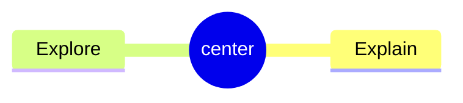
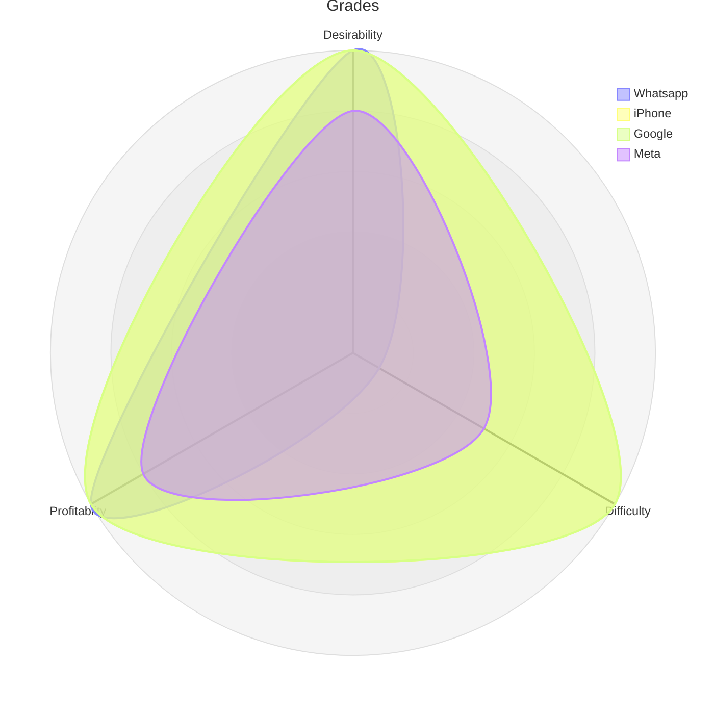
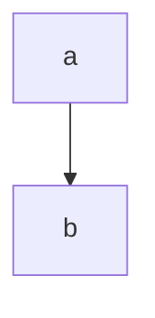
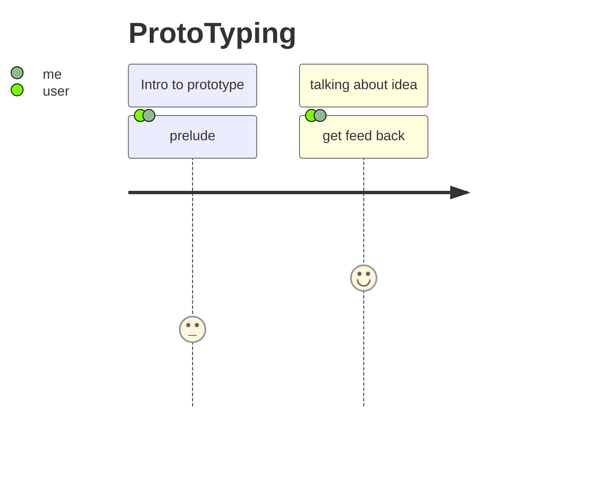

```mermaid
mindmap
  root((center))
    Explain
    Explore
```

```mermaid
---
title: "Grades"
---
radar-beta
  axis m["Desirability"], s["Difficulty"], e["Profitablity"]
  curve a["Whatsapp"]{100, 10, 100}
  curve b["iPhone"]{100, 100, 100}
  curve b["Google"]{100, 100, 100}
  curve b["Meta"]{80, 50, 80}

  max 100
  min 0


```

```mermaid
gantt 
  title Product Market Fit Road map
```

```mermaid
flowchart TD
a --> b
```

```mermaid
journey
  title ProtoTyping
  section Intro to  prototype
    prelude: 3: user,me

  section talking about idea
    get feed back :5: user,me
```

