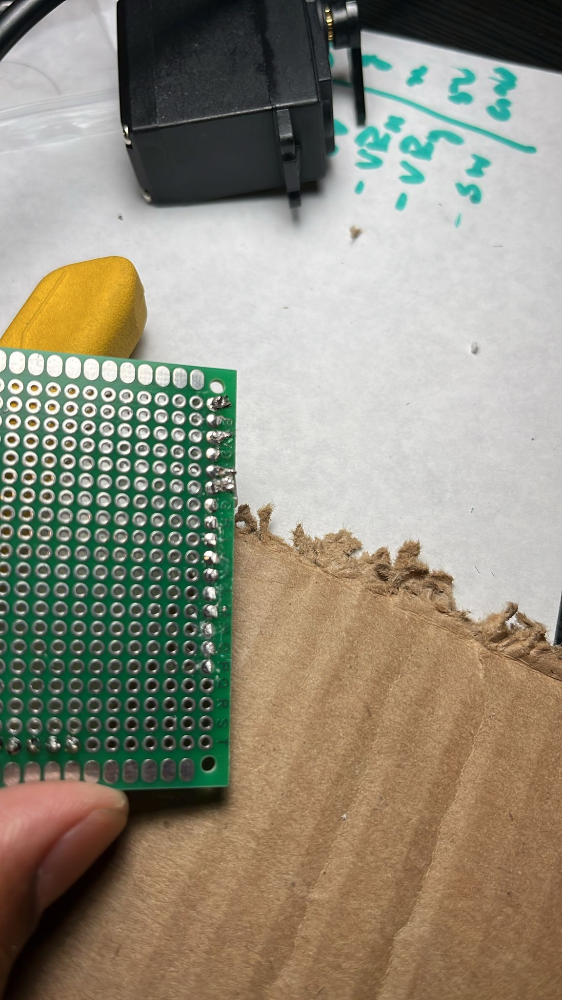
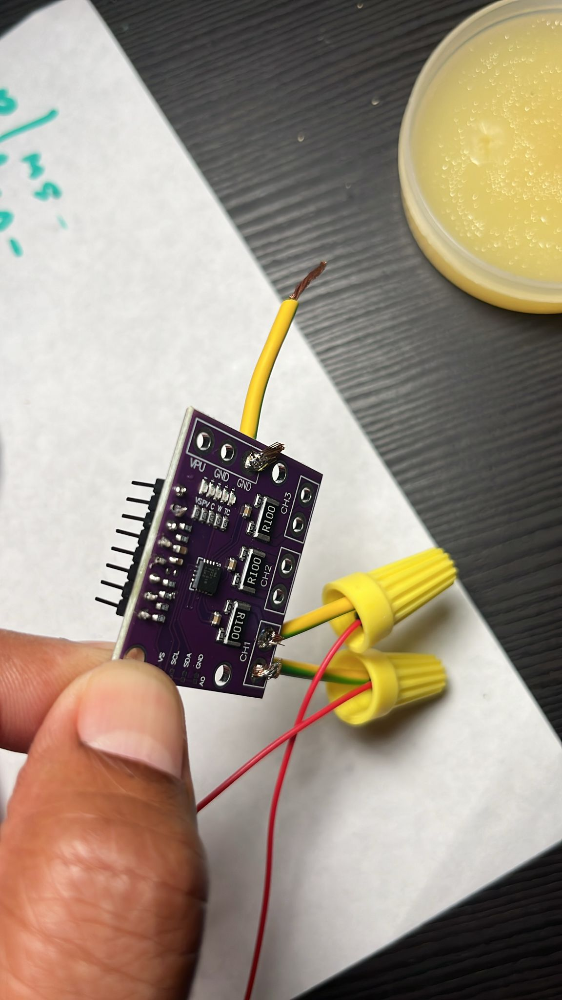



  🚧 This post is a Work In Progress — feel free to share feedback.



### 13JUL2025
- Got inspired from a friend about how AI would influence generic robotics.
- Spoken with Mukilan by deciding to start from robotic arm
### 02AUG2025 
- seriously started 
### 03AUG2025

#### software
- stack 
  - started with ubuntu 22.04 | ros2 humble - rviz2 - moveit2 - gazebo - installed on lenova pc all up and working until moveit2
  - Moved to ubuntu 24.04 | ros2 jozzy (to go ubuntu 24.04, since rpi 5 needs 24.04)
  - migrated from ubuntu 22.04 to 24.04
#### hardware
Buy (costs around 25K ) vs build ( possible to build below 7k)
- ##### Fabrication
  - 3D printing (Tried  few prints from community library , staff was very helpful)
    - printers : FDM vs SLA
    - materials 
      - PLA - versatile
      - PETG - intermitant 
      - Nylon - strong

### 08AUG2025 
#### SERVO MOTORS
- They are heart of a robotic arm
- Dynamixel is the leading supplier of stronger precise robotic arm

### 11AUG2025

- #### Servo motors

#### 14AUG2025
- SOLDERING
  - After few mistakes, followed a nice tutorial and got hold of it.
  - 
  - Lessons learnt :  
    - Soldering is mini welding you melt metal and pour very small in quantity though. Use safety glass , there is a possibility of molten metal spill somewhere. Use right soldering tip. 
    - Don’t keep lead on soldering iron,instead heat the wire to be soldered and keep lead there and  let it to melt and nicely settle.
- BASIC ELECTRONICS
  - Yes it is  v=I R, P= I^2 R
  - Learnt internals of a potentiometer by burning it, was playing around with a circuit , 6v -> 10K (var res ) --> motor (6v rated) --> .3A
    - When I increased resistance to 4K , current is bellow 0.05A , so tried increasing volt to 10V then 20V. still current is low, now reduced res to below 1K , saw fume from var res.
  - Got an idea between current and Torque on Motor

#### 15AUG2025
- Set up 3D Prusa core get the sample printing done

#### 16AUG2025
- Tried with Nylon and failed print
- Studied papers on imimation Learning and ALOHA 

#### 18AUG2025
- As printing completed for v1, need different screws explored different screw types, needed m3 12mm and few shaft screws. Found Dave hardware has all the required screws.